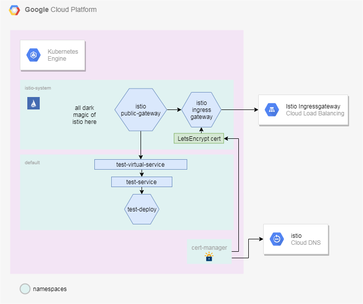

# GKE Cert-Manager

Introduction
---

Nowadays it is a tremendous mistake to make your website available without 
any kind of HTTPS implementation. There are a bunch of options on the internet 
including free options and this is a must if you want to provide the least
a little bit of security. 

This repo is to be used together with the GKE Bootstrapper, but it is not a 
requirement. The things you need are:

   - Kubernetes Cluster
   - Istio 1.8 or above
   - Helm
   - Your own domain

Although using the GKE Bootstrapper is not necessary, it is higly recommended. 
The reason is because you will not need to modify any of the source code to have 
a certificate issued by LetsEncrypt. If you have your cluster in AWS, you will 
need to dive into cert-manager documentation and find out how LetsEncrypt can 
verify against Route53. It is on the roadmap of this project to make this repo 
adjustable depending on the provider, but there is no deadline for this feature.

---

## How to use this repository

To provision necessary resources, use the bellow script.

```
cd src
./apply.sh
```

This will deploy cert-manager objetcs into your cluster in a dedicated namespace. 
Within GCP provider, it will deploy a service account with DNS permissions to edit 
necessary routes in the istio CloudDNS zone. With the service account created and 
bounded to the cluster as a secret, it will try to issue a LetsEncrypt certificate. 
This process can take up to 10 minutes, but within GCP provider this is all automated. 

After the certificate is ready, a Istio Gateway is also created. This istio gateway 
take advantage of the istio ingressgateway and can be used to expose frontend applications 
to the internet with TLS encryption. The diagram can be seem bellow.  



## How to expose applications using TLS

Whenever you want to expose your application to the outside world using your nearly 
created certificate, your kubernetes objects are not going to change that much. What you 
need as always is a deployment (or whataver other application controller you are exposing) 
and a service of type ClusterIP. A new object is introduced, named VirtualService. The 
virtual service object is part of the Istio Custom Resource Definition and it will make 
the midfield between your service and istio public gateway. Take the bellow example to 
make the magic happen to your applications! This will deploy a application exposed to the 
world using TLS on the endpoint https://test-gke-pod.arakaki.in. Give it a try!

```
DOMAIN="arakaki.in"
helm repo add sp https://stefanprodan.github.io/podinfo
helm upgrade my-release --install sp/podinfo 
kubectl apply -f - <<EOF
apiVersion: networking.istio.io/v1alpha3
kind: VirtualService
metadata:
  name: test-gke-pod
  namespace: default
spec:
  hosts:
   - "test-gke-pod.${DOMAIN}"
  gateways:
  - public-gateway.istio-system.svc.cluster.local
  http:
  - route:
    - destination:
        host: my-release-podinfo
        port:
          number: 9898
EOF
```

## Destroy resources

```
cd src
./destroy.sh
```

## Debug Cert-Manager

You can use the following commands to debug your instalation:

```
kubectl get pods -n cert-manager
```

Output:

```
NAME                                       READY   STATUS    RESTARTS   AGE
cert-manager-5d67c788fd-hs94s              1/1     Running   0          11m
cert-manager-cainjector-57988f84f7-gxgdg   1/1     Running   0          11m
cert-manager-webhook-54b5f85648-p6bsf      1/1     Running   1          11m
```

Get cert-manager pod logs with:

```
kubectl -n cert-manager logs -f cert-manager-5d67c788fd-hs94s
```

Output:

```
I0930 16:25:35.279074       1 sync.go:331] cert-manager/controller/certificates/certificates "level"=0 "msg"="certificate scheduled for renewal" "duration_until_renewal"="1438h59m58.720970602s" "related_resource_kind"="Secret" "related_resource_name"="istio-ingressgateway-certs" "related_resource_namespace"="istio-system"
I0930 16:25:35.279674       1 controller.go:135] cert-manager/controller/certificates "level"=0 "msg"="finished processing work item" "key"="istio-system/istio-gateway"
I0930 16:25:39.868581       1 controller.go:135] cert-manager/controller/challenges "level"=0 "msg"="finished processing work item" "key"="istio-system/istio-gateway-31742858-0"
I0930 16:25:39.868636       1 controller.go:129] cert-manager/controller/challenges "level"=0 "msg"="syncing item" "key"="istio-system/istio-gateway-31742858-0"
I0930 16:25:40.137989       1 controller.go:129] cert-manager/controller/orders "level"=0 "msg"="syncing item" "key"="istio-system/istio-gateway-31742858"
I0930 16:25:40.138695       1 controller.go:135] cert-manager/controller/challenges "level"=0 "msg"="finished processing work item" "key"="istio-system/istio-gateway-31742858-0"
I0930 16:25:40.138867       1 controller.go:129] cert-manager/controller/challenges "level"=0 "msg"="syncing item" "key"="istio-system/istio-gateway-31742858-0"
E0930 16:25:40.138975       1 controller.go:192] cert-manager/controller/challenges "msg"="challenge in work queue no longer exists" "error"="challenge.certmanager.k8s.io \"istio-gateway-31742858-0\" not found"
I0930 16:25:40.139068       1 controller.go:135] cert-manager/controller/challenges "level"=0 "msg"="finished processing work item" "key"="istio-system/istio-gateway-31742858-0"
I0930 16:25:40.139654       1 controller.go:135] cert-manager/controller/orders "level"=0 "msg"="finished processing work item" "key"="istio-system/istio-gateway-31742858"
```

Get certificate status with:

```
kubectl get certificates -n istio-system
```

Output:

```
NAME            READY   SECRET                       AGE
istio-gateway   True    istio-ingressgateway-certs   15m
```